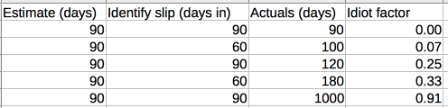

I worked with a PM who had a pet concept he called the "Idiot Factor". With
regards to hitting deadlines on a software project:

> If you're going to slip a schedule, the later in the schedule you communicate
out that you are slipping, and the more you are slipping by, the higher your
idiot factor.

In other words, slipping a three month project by a week is OK, as long as you
let people know a month in advance. But identifying a slip very late, or not
identifying a very large slip is not OK.

# Running the Numbers

If you're going to call something a factor, might as well make it an actual
number. Here is the formula I came up with:

- E is your original estimate in days
- C is how many days in you waited to communicate the schedule change
- N is the new total estimate in days

`I.F. = (1-(E/N)) * C/E`

Note: if you identify the estimate is wrong early AND don't slip it by too much,
you're fine.

# Tech Leads

# Product Managers

Blog about the idiot factor both fit engineers need to tell you they're sleeping early and management needs to tell you if you're changing the product early

idiot proof
doing something the hard way
id10t factor - A computer error that was actually caused by the computer user
the father away someone is from us, the more we think of them as idiots

How a good PM deals with scope creep: “Changes affecting requirements almost always stop projects in their tracks,” notes Jun Bucao, PMP, senior project/program manager, HP Technology Services Consulting.
https://www.cio.com.au/article/565027/7-ways-project-managers-can-anticipate-avoid-mitigate-problems/

Sadly, the desire of stakeholders to have “predictable” schedules or costs results in significant dysfunction within a software development team.
http://www.disciplinedagiledelivery.com/software-guesstimation/

It's like my mother used to threaten when I was a kid "Hurry up and pick out some clothes, or I'll pick them out for you!"
https://softwareengineering.stackexchange.com/questions/648/how-to-respond-when-you-are-asked-for-an-estimate

slip once, and slip hard. If you're a week out, and going to miss by a day, slip the date a week.
https://news.ycombinator.com/item?id=8482673
